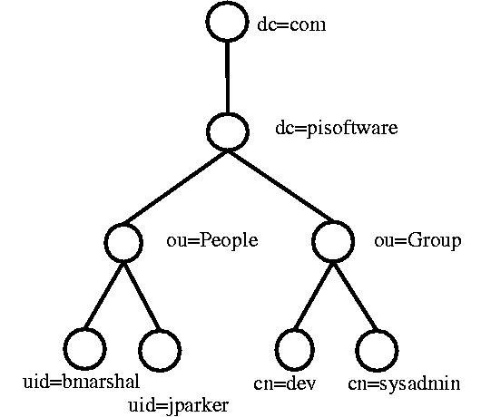

## LDAPとは

LDAP(Lightweight Directory Access Protocol)は、TCP/IP上でディレクトリーサービスを照会・修正する応用プロトコルである。
ディレクトリーは論理、階級方式で組織化した、似ている特性を持つオブジェクトの集まりである。最も一般的な例としては、電話帳(Telephone  Directory)があってカナ順の一連の名前を持ち、名前ごとに電話番号と住所が含まれている。このような基本設計のため、LDAPは認証のためのサービスでよく使われる。

## LDAPの構造例

とは言っても文字だけでは、分かりにくいので、下図で説明する。

> LDAPの構造例(http://quark.humbug.org.au/publications/ldap/ldap_tut.html)

上のツリーで一番下にあるノードを見ると、 
uid=bmarshal,  uid=jparker,  cn=dev,  cn=sysadmin 
がある。
まず、ユーザーのuid=bmarsharlを見てみると、pisoftware.com(dc)というドメインにPeople(ou)というグループに属しているユーザーということが分かる。 
一般的に、各ユーザや個体を固有に表すものをDN(Distinguish Name)と呼ぶ。DNを表示するときはノードの一番下から逆上がる。bmarshalというユーザは、次のようなDNを持つことになる。 

ex) uid=bmarshalのDN 
dn="uid=bmarshal, ou=People, dc=pisoftware, dc=com"

上記のように逆上がりであると、それぞれの最後のノードはいつも固有のDNを持つようになる。 
 （このノードをLDAPではエントリと呼ぶ。 )

## 主要エントリの種類

ここでは、主要エントリの種類を整理する。これより多くのエントリーがあるが、主に使用しているエントリーは以下の通りである。 

- CN(Common Name): Sato Taro, Danaka Shunなどの一般的な名前 
- SN(Sir Name): 苗字のこと
- OU(Organiztion Unit):グループに該当  
- DC(Domain Component):ドメインに対する要素 
ex) tech.example.com  
dcはexample.comあるいはtech.example.com両方該当 
- DN(Distinguished Name):上記のエントリおよびその他の様々なエントリから、特定のユーザー(またはオブジェクト)を区別できる固有の名前。  

## Objectclass

全てのエントリは1つ以上のObjectclassを持つ。 Objectclassとは、同じ設定を持つ一種のグループだと理解すれば良い。
新しいエントリが作成する時に特定のObjectclassに属するエントリを作成すると、そのObjectclassのプロパティがそのまま継承する。