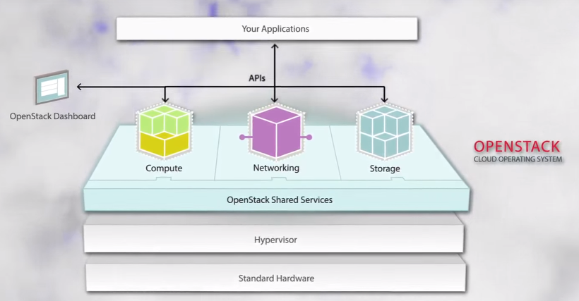
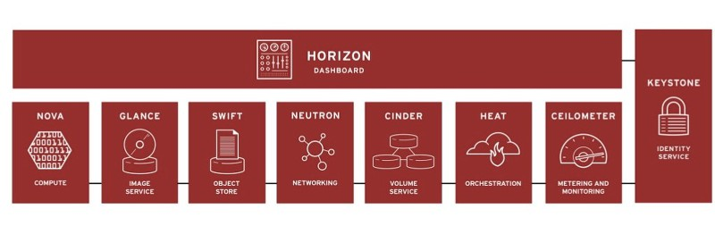

## Openstackとは
クラウドに関わっている開発者なら、Openstackという単語を少なくとも一度は聞いたことがあるだろう。Openstackは、RackspaceとNASAからスタートしたIaaS(Infrastructure as a Service)を構築するソフトウェアで、グローバルIT企業の多くが参加しているオープンソースプロジェクトである。IaaSという言葉からも分かるように、**クラウドインフラに必要なサーバの仮想化、ストレージの仮想化、ネットワークの仮想化技術を総合的に実現する。**

## なぜ使うのか
クラウドコンピューティングに使用するサーバを制御するためには、専門的なハードウェア知識とサーバを運営するオペレーティングシステムの知識が必要となるが、これはどのハードウェアとオペレーティングシステムを使用するかによって異なり、環境が変わるたびに新しい知識を習得しなければならない問題がある。

このような問題を解決するために、**サーバのハードウェアやOSを問わず、クラウドコンピューティング開発の標準を提供するのがオープンスタックである。**

> Hardware, Hypervisor上でShared Serviceの形でCompute, Networking, Storageを制御するサービスを提供する(https://www.cio.com/article/2379588/an-openstack-primer-for-it-executives.html)

Compute、Networking、Storageなどを管理できるAPIを提供し、これを管理するDashboardで開発者が簡単にクラウドコンピューティング環境で作業できるようにサポートするサービスである。また、Hardware、Hypervisor関連作業はすべてオープンスタックが処理するため、開発者はApplicationを作る作業に集中できる。

## Openstackのサービス

> Openstackのサービス(https://sios.jp/products/redhat/rhel/openstack/)

1. Horizon (Dashboard)
- OpenStackで起きるサービスに対するインターフェースをWebBaseで提供。
- VMを生成したりIPを指定したりするなどのサービスをCLIではなくウェブでユーザが直接実行できるようにするツール。

2. Keystone（Identity）
- OpenStackが提供する全てのサービスに対する認証と権限付与を担当。
- 認証のほか、ユーザー管理、セキュリティグループ管理、各種サービスのEndpoint  URL(Rest  API)を管理する機能を提供。
- Keystoneを通じてユーザーが該当サービスを実行する権限があるかどうかを確認。

3. Nova（Compute）
- ユーザーのRequestをVM内部で変換してComputeサービスに適用する。
- VM生成、IPの接続などの作業を実行してComputeリソースを管理する役割。
- ホスト管理、多数のHypervisorサポート

4. Glance（Image）
- VMディスクのイメージを保存して読み込む役割。
- NovaがVMを作成する際にGlanceからイメージを読み込んでプロビジョニングを行う。

5. Neutron (Networking)
- ネットワークを仮想化してサービスを提供するデバイスに付ける。
- ユーザが独立したネットワークを作ることやデバイスだけを選択して接続することができる。

6. Cinder (Block Storage)
- VMにボリュームを提供する。 VM作成時、ボリュームを接続したり、既に生成されたVMにボリュームを接続したり、接続を解除して他のVMに接続することも可能。

7. Ceilometer (Telemetry)
- OpenStack Cloudの費用や統計情報をモニタリング·メータリングするサービス。