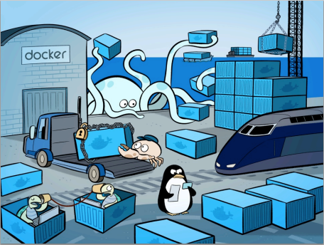
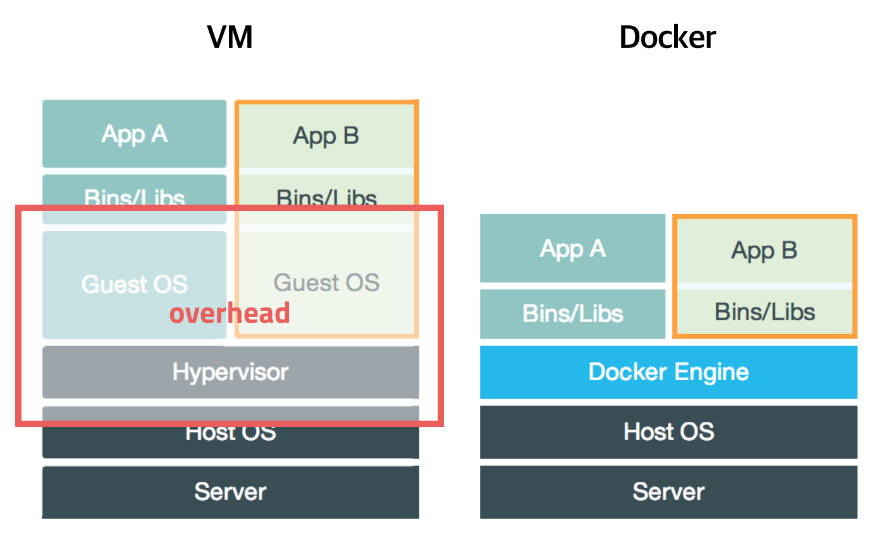

## ドッカー(Docker)とは
一言で言うと**コンテナ基盤のオープンソース仮想化プラットフォーム。**

コンテナといえば、船に積む四角の貨物輸送用ボックスが考えらる。それぞれのコンテナの中には、服、靴、電子製品、酒など様々な荷物を入れることができ、規格化されているため、コンテナ船やトレーラーなどの運送手段で容易に運ぶことができる。  

サーバで話しているコンテナも同じで、様々なプログラム、実行環境をコンテナで抽象化し、同じインターフェイスを提供することでプログラムの配布および管理をシンプルにしてくれる。バックエンドプログラム、データベースサーバ、メッセージキューなど、どのプログラムもコンテナで抽象化でき、組み立てPC、AWS、Azure、GCPなど、どこからでも実行できる。  

コンテナを最もよく使っている企業はグーグルらしく、2014年の発表によるとグーグルはすべてのサービスがコンテナで動作し、毎週20億個のコンテナを駆動するそうだ。

## コンテナー(Container)

> ドッカーはコンテナーを管理するプラットフォーム(https://www.docker.com/resources/what-container)

コンテナは隔離された空間でプロセスが動作する技術である。仮想化技術の一つであるが、従来の方式とは違いがある。

従来の仮想化方式は、主に**OSを仮想化**していた。

お馴染みのVMwareやVirtualBoxのような仮想マシンは、ホストOS上にゲストOS全体を仮想化して使用する方法である。この方式は、いろいろなOSを仮想化すること（WindowsからLinuxを起動するとか）ができ、比較的使い方は簡単だが、重くて遅かったため、運営環境ではあまり使えなかった。

このような状況を改善するために、CPUの仮想化技術(HVM)を利用したKVM`Kernel-based Virtual Machine`と半仮想化`Paravirtualization`方式のXenが登場する。この方式は、ゲストOSが必要だが、全体のOSを仮想化する方式ではなかったため、ホスト型仮想化方式に比べて性能が向上している。これらの技術はOpenStackやAWS、Rackspaceなどのクラウドサービスにおける仮想コンピューティング技術の基盤となった。

> 仮想マシンとドッカー(https://www.docker.com/resources/what-container)

全仮想化であれ、半仮想化であれ、追加のOSをインストールして仮想化する方法は、いずれにせよ性能の問題があり、これを改善するために**プロセスを隔離する方式**が登場する。

Linuxでは、この方式をLinux Containerと言い、単純にプロセスを隔離するため、軽くて速い動作する。 CPUやメモリは、プロセスが必要な分だけ追加して使用し、性能的にもほとんど損失がない。

ひとつのサーバに複数のコンテナを実行すると、互いに影響を及ぼさず独立的に実行され、まるで軽いVMを使用しているような気がする。実行中のコンテナに接続してコマンドを入力することや、apt-getやyumでパッケージをインストールすること、ユーザーを追加して複数のプロセスをバックグラウンドで実行することもできる。CPUやメモリの使用量を制限することができ、ホストの特定ポートと連携したり、ホストの特定ディレクトリを内部ディレクトリのように使用することもできる。

新しいコンテナを作るのにかかる時間はたったの1-2秒で、仮想マシンとは比較にならないほど速い。

