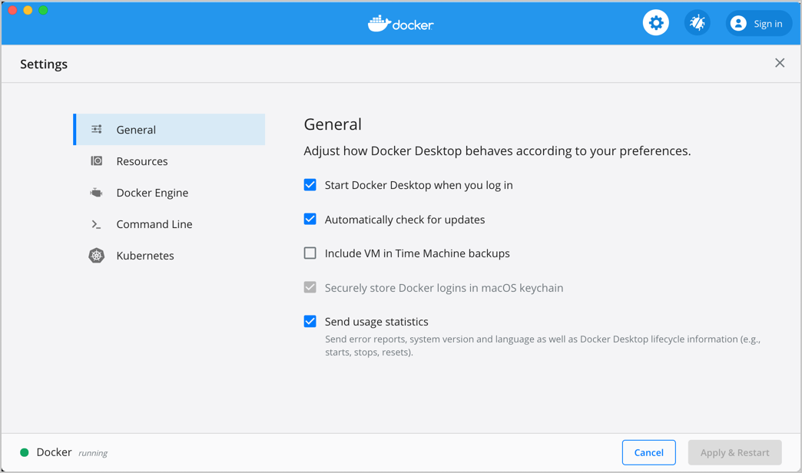

ドッカーはLinuxのコンテナ技術なので、macOSやWindowsにインストールする場合は仮想マシンを利用する。

## Linux

Linuxにドッカーを取り付ける方法は、自動インストールスクリプトを利用するのが最も簡単。次のコマンドを入力すると、root権限を要求してしばらく待つとインストールが完了する。
※ubuntuとCentOS用のコマンド
```
curl -fsSL https://get.docker.com/ | sudo sh
```

- sudoなしで使用する  

dockerは基本的にroot権限が必要である。rootではないユーザーがsudoなしで使用するには、そのユーザーをdockerグループに追加する必要がある。

```
sudo usermod -aG docker $USER # 現在接続中のユーザーに権限を与える
sudo usermod -aG docker your-user # your-userというユーザーに権限を与える
```

- Docker for Mac / Docker for Windows

ドッカーをMacやWindowsにインストールするには、Docker  for  macまたはDocker  for  windowsをインストールする。ファイルをダウンロード・インストールして、リブートすれば、ほとんど問題なく完了する。細かいオプションがあるが、普通なら特に触れる部分はない。(ただし、Windowsは共有ドライブを選択すること)


> Docker for Mac(https://docs.docker.com/docker-for-mac/)

まるでネイティブアプリのようにインストールされたようだが、ドッカーはリナックスコンテナなので、実際には仮想マシンにインストールされている。ユーザーは仮想マシンを使っているという気が全くしない。 例えば、ポートを接続するためには、もともとならドッカーコンテナの特定のポートを仮想マシンに接続し、再びmacやWindowsのポートと接続しなければならない。ディレクトリをつなげると、ディレクトリを仮想マシンと共有し、そのディレクトリをコンテナとつなげる必要がある。このような1段階追加的に操作しなければならない部分を自然に処理してくれる。

- インストールの確認

インストールが完了したら、正常にインストールされたかドッカーコマンドを入力して確認する。

```
docker version
```

クライアントとサーバー情報が正常に出力されたら、インストールが完了したことになる。
