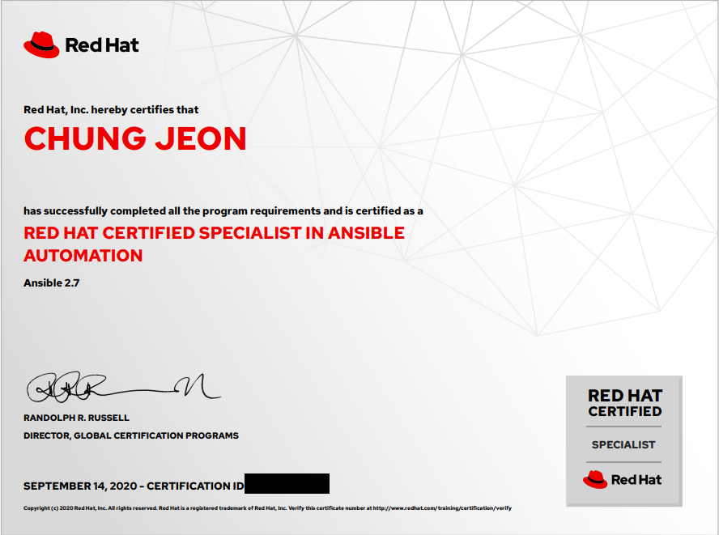

この前、Red Hat Certified Specialist in Ansible Automation(RHCSAA)の資格が取れたので、その情報を共有する。

## RHCSAAとは？  
Red Hatが認証するAnsibleの資格のこと。Ansibleの資格ではあるものの、基本的にLinuxに対してRHCEレベルの基本知識を応用するので注意。

## テストの時間
**４時間**のテストで、１時間ごとに10分だけ休憩を取られる。ただ、この10分の間もテストの時間は流れるので注意すること。
ちなみに、僕の場合、今回は1時間ぐらい時間が余っていたが、初回受けた際はテストの進行方式を調べ切ってないまま受けて、環境把握だけですごい無駄な時間を過ごしたせいで時間が足りなかった。
（もちろん、自分の実力が足りなかったせいがもっと大きい）

## 問題形式
Red Hatの資格は全て**ハンズオン（Hands-on）形式**で行われる。RHCSAAも例外ではない。
ほとんどが問題の指示通りに動くPlaybookを実装する内容。基本的には、DO407のテキストの練習問題が解けるレベルであれば、書き方に困ることはないはず。

## テスト時の参考文書
Ansibleは`ansible-doc`というコマンドで、モジュールの書き方を調べることができる。Ansibleの公式文書である[Ansible Documentation](https://docs.ansible.com/ansible/latest/modules/modules_by_category.html)のcli versionだから、これを使ってーというアドバイスが[RedditのRed Hatコミュニティ](https://www.reddit.com/r/redhat/)に多かった。しかし、実際テストのインストラクションに良く目を通してみると、最後らへんに**ウェブ版のAnsible Documentationを使えるリンク**がある。コマンドで検索することとウェブ版を使うことは天地の差なので、これを使うことがおすすめ。

## テスト環境
Linux上にControl NodeとTarget NodeをVMで管理している環境。それぞれのVMコンソールを開いて作業する人も多いみたいだが、これもインストラクションに書いてある通り、**SSH通信のための鍵交換は既にできている**ので、ターミナルからsshで接続して作業する方がおすすめ。（VMコンソールではマウスの操作が不可能）

## その他のTip
- **インストラクションをよく読んでおくこと**。環境の変数だけを読んでそのまま問題に行く人も多いだが、思ったより重要な情報がたくさん書いてあるので、ちゃんと最後まで読んでほしい。
- 問題セットは毎回変わる。ただ、似たような問題も多いので、落ちたとしても前回のテスト内容を振り返ってみること。
- 採点はすべてスクリプトで行われ、その基準は公開されない。つまり、結果をもらっても、自分がどこでミスったかは推測でしか分かることができない。
- 採点はPlaybook以外はすべてを初期化してから、Playbookを実行した結果で行う。**Playbookのファイル名が間違ってしまうと０点になる**ので注意すること。
- DO407のテキストには載せてないモジュールなども出てくるので、Ansible Documentionの使い方に慣れておくこと。

