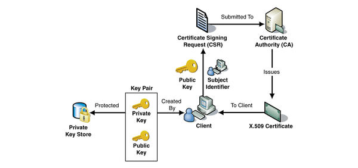
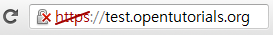
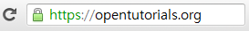

## SSLサーバ証明書

SSLサーバ証明書は、クライアントとサーバ間の通信を第三者が保証する電子化文書です。クライアントがサーバに接続した直後に、サーバはクライアントにこの証明書の情報を渡します。クライアントは、この証明書情報が信頼できるものであるかを検証した後、次の手順を実行することになります。

> SSL Process(https://www.thesslstore.com/blog/ssltls-certificate-its-architecture-process-interactions/)

SSLとSSL証明書を利用した際の利点は下記の通りです。

-  通信内容が攻撃者に漏れることを防ぐことができます。
-  クライアントが接続しようとするサーバが、信頼できるサーバであるかどうかを判断することができます。
-  通信内容の悪意ある変更を防止できます。

### SSL証明書の役割

SSL証明書の役割は多少複雑であるため、証明書のメカニズムを理解するための知識を知っておかなければなりません。証明書の機能は大きく分けて2つあります。以下の2つを理解することが証明書を理解するポイントになります。

1. クライアントが接続したサーバーが、信頼できるサーバーであることを保障します。
2. SSL通信に使用する公開鍵をクライアントに提供します。

### CA

証明書の役割は、クライアントが接続したサーバがクライアントが意図したサーバで合っているかどうかを保障する役割をします。この役割をする民間企業がいますが、このような企業を**CA(Certificate Authority)**あるいは**Root Certificate**と呼びます。CAはどんな企業でもやれるわけではなく、その信頼性が厳格に公認された企業だけが参加できます。

- Symantec (VeriSign, Thawte, Geotrust) with 42.9% market share
- Comodo with 26%
- GoDaddy with 14%
- GlobalSign with 7.7%

SSLを通じて暗号化された通信を提供するサービスは、CAを通じて証明書を購入しなければなりません。CAではサービスの信頼性をさまざまな手法で評価することになります。

> 認証されてないCertification

> 認証されたCertification

上記のように、公認のCAが提供する証明書を使用する場合、ブラウザのアドレスバーが安全表示をやってくれます。

開発サーバーなどで直接証明書を発給してテストしてみてもいいです。サイトに対する信頼性は、開発者が確保しているので直接開発サーバー自体がCAの役割を果たしながら、SSLを使用する方法もあります。急速にSSLを使用できるメリットがあります。publicなサービスではこれを使用してはいけません。

### SSL証明書の中身

SSL証明書には、次のような情報が含まれています。

1. サービスの情報（証明書を発行したCA、サービスのドメインなど）
2. サーバ側の公開鍵（公開鍵の中身、公開鍵の暗号化方法）

証明書の中身は、上記のように大きく2つに分けることができます。1番目はクライアントが接続したサーバが、クライアントが意図したサーバであるかについての内容が含まれており、2番目はサーバと通信するときに使用する公開鍵とその公開鍵の暗号化方法などの情報が含まれています。**サービスのドメイン、公開鍵などの情報は、サービスがCAから証明書を購入する際に提出**しなければなりません。

上記のような内容はCAによって暗号化されます。このとき使用する暗号化手法が公開鍵方式です。CA  は自身のCA公開鍵を用いてサーバが提出した証明書を暗号化します。CAの非公開鍵は絶対に流出していけません。これが流出したせいで、デジノタという会社が破産した事例もあります。

### CAのことをブラウザは知っている

証明書を理解するのに必ず知っていなければならないのがCAのリストです。ブラウザは内部的にCAのリストを事前に把握しています。つまりブラウザのソースコードの中にCAのリストが入っているということです。ブラウザが事前に把握しているCAのリストに含まれてこそ、公認されたCAのあるということです。CAのリストとともに、各CAの公開鍵をブラウザはすでに知っています。

