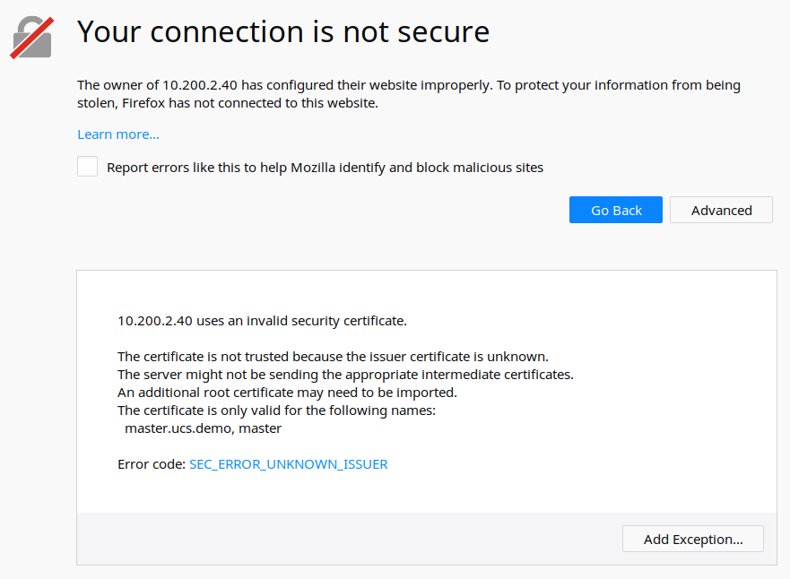

## SSLの動作プロセス

SSLは暗号化されたデータを転送するために公開鍵と対称鍵を混合して使用します。つまりクライアントとサーバがやり取りする実際の情報は共通鍵方式で暗号化し、共通鍵方式で暗号化された実際の情報を復号する際に使用する共通鍵は公開鍵方式で暗号化し、クライアントとサーバがやり取りすることになります。

- 実際のデータ: 共通鍵
- 共通鍵の鍵: 公開鍵

コンピュータとコンピュータがネットワークを利用して通信を行う際には、**「ハンドシェイク → 転送 → セッション終了」**の3つのステップがあります。

> ハンドシェイクのプロセス(https://www.cloudflare.com/ko-kr/learning/ssl/what-happens-in-a-tls-handshake/)

### ハンドシェイク(Handshake)

実際のデータのやり取りの前に、クライアントとサーバは一種の挨拶であるハンドシェイクを行います。この過程で、互いに相手が存在するのか、また相手とデータをやり取りするためにはどのような方法を使用しなければならないのかを把握します。

SSL方式を利用して通信を行うブラウザとサーバもハンドシェイクをしますが、この時SSL証明書をやり取りすることになります。証明書に含まれているサーバ側の公開鍵の役割は何でしょう。

公開鍵は理想的な通信方法です。暗号化と復号を行う際に使用する鍵が異なるため、メッセージを送信する側が公開鍵でデータを暗号化し、受信先が非公開鍵でデータを復号すればよいからです。しかしSSLではこの方式を使用しません。なぜなら、公開鍵方式の暗号化は、非常に多くのコンピュータ資源を使用するためです。一方、暗号化と復号に使用される鍵が同一な共通鍵方式は少ないコンピュータリソースで暗号化を行うことができるため効率的ですが、受信側と送信側が同一な鍵を共有しなければならないためセキュリティの問題が発生します。そのため、SSLは公開鍵と共通鍵の長所を混合した方式を使用します。ハンドシェイクの段階でクライアントとサーバが通信するプロセスを順番に見てみると、次のようになります。

1.クライアントがサーバに接続します。このステップを`Client Hello`といいます。この段階で交わす情報は以下の通りです。

- **クライアント側で生成したランダムデータ**
- **クライアントが支援する暗号化方法**: クライアントとサーバーが支援する暗号化方式が異なる場合もあるために相互間でどのような暗号化方式を使用するかに対する交渉をしなければなりません。この交渉のためにクライアント側では自分が使用できる暗号化方式を伝送することになります。
- **セッション・アイディ(Session ID)**: すでにSSLハンドシェイクを行っている状態であれば、費用と時間を節約するために既存のセッションをリサイクルすることになるので、この時使用する通信の識別子をサーバ側に伝送します。

2.サーバは、`Client Hello`への応答として、`Server Hello`を行います。この段階で交わす情報は以下の通りです。

- **サーバー側で生成したランダムデータ**
- **サーバが選択したクライアントの暗号化方式**: クライアントが配信した暗号化方式の中から、サーバ側でも使用できる暗号化方式を選択してクライアントに配信します。これにより、暗号化方式についての交渉が終了し、サーバとクライアントはこの暗号化方式を利用して情報を交換することになります。
- **証明書**

3.クライアントは、サーバの証明書がCAによって発行されたものかどうかを確認するために、クライアントのCAリストを確認します。CAリストに証明書がない場合は、ユーザーに警告メッセージを出力します。証明書がCAによって発行されたものであることを確認するためには、クライアントのCAの公開鍵を利用して証明書を復号します。復号に成功したならば、証明書はCAのプライベート鍵で暗号化された文書であることが間接的に保証されたものになります。これらの手順により、証明書を送信したサーバーが信頼できるようになります。

> CAリストに証明書がない際の警告(https://www.cloudflare.com/ko-kr/learning/ssl/what-happens-in-a-tls-handshake/)

4.クライアントは2番目のステップを通じて受け取ったサーバのランダムデータとクライアントが生成したランダムデータを組み合わせて、`Pre-Master Secret`という鍵を生成します。この鍵は、後で確認するセッションの段階でデータをやり取りするときに暗号化するために使われます。このとき使用する暗号化手法は共通鍵であるため、Pre-Master Secret値は第三者に絶対に流出されてはいけません。

5.サーバは、クライアントが送信したPre-Master Secret値を自身の非公開鍵で復号化します。これで、サーバとクライアントが両方のPre-Master Secret値を共有することになりました。そして、サーバとクライアントは一連のプロセスを経てPre-Master Secret値を`Master Secret`値にします。Master Secretで`Session Key`を生成し、サーバとクライアントはこのSession Key値を利用してデータを共通鍵方式で暗号化した後にやり取りします。こうしてセッションキーをクライアントとサーバが両方とも共有することになります。

6.クライアントとサーバは、ハンドシェイク段階の終了をお互いに通知します。

### セッション(Session)

セッションはサーバとクライアントが実際にデータをやり取りする段階です。この段階で重要なのは、情報を相手に送信する前にセッションキー値を利用して共通鍵方式で暗号化するという点です。暗号化された情報は相手側に送信され、相手側もセッションキー値を知っているため、暗号を復号することができます。

公開鍵を使えばよいのに、共通鍵と公開鍵を組み合わせて使う理由は何でしょう？それは公開鍵方式がコンピューターパワーを大量に使うためです。もし公開鍵をそのまま使えば、多くのアクセスが殺到するサーバは非常に大きな費用を支払わなければならないでしょう。逆に、共通鍵は暗号を解く鍵である共通鍵を相手に転送しなければなりませんが、暗号化されていないインターネットを通じて鍵を転送することは危険です。そのため、**速さは遅いがデータを安全にやり取りできる公開鍵方式で共通鍵を暗号化し、実際のデータをやり取りする際には共通鍵を利用してデータをやり取りする**のです。

### セッション終了

データを送信し終わったら、SSL通信が終わったことをお互いに知らせます。このとき、通信で使用した共通鍵であるセッションキーを廃棄することになります。

