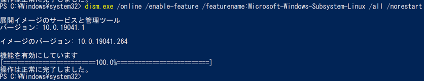
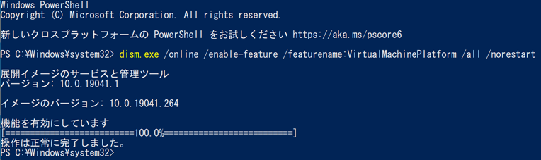
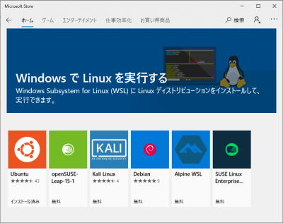
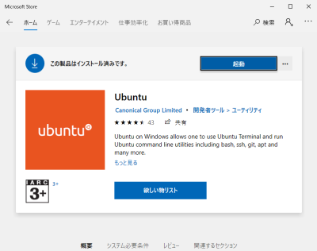
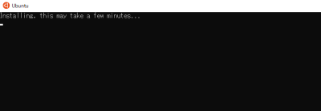
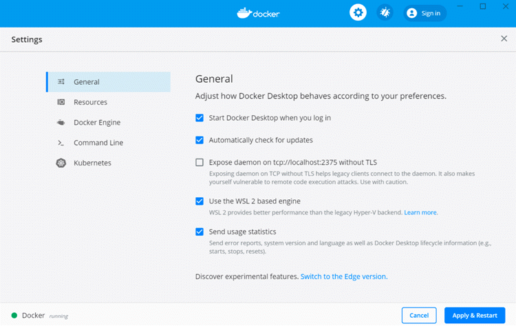
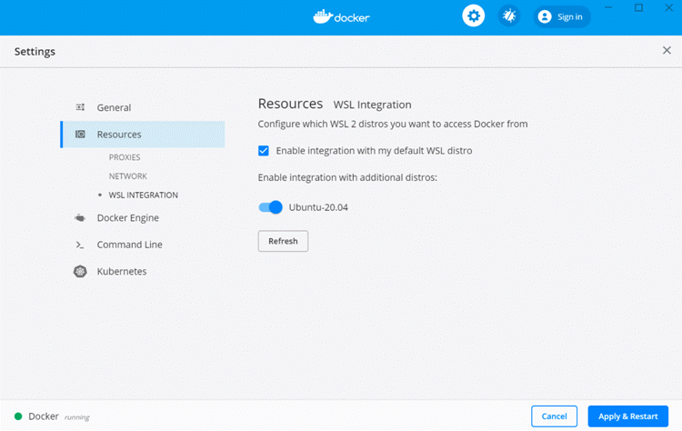
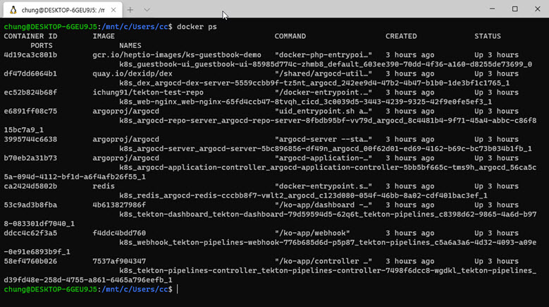

# How to integrate Docker with WSL

Windowsの環境でWSLを使用してLinuxによるDocker操作を導入する手順


## WSL(Windows Subsystem for Linux)の導入

### そもそもWSLとは

WSLは、Windows上で軽量仮想化技術を使用してLinuxの駆動をサポートする機能です。WSL2はWSLを大幅に改善し、さらに優れた性能と統合された環境が利用できます。

> Windows Subsystem for Linuxを使用すると、開発者は、仮想マシンのオーバーヘッドなしで、ほとんどのコマンド ライン ツール、ユーティリティ、アプリケーションを含む GNU/Linux 環境を変更せずそのまま Windows 上で直接実行できます。(https://docs.microsoft.com/ja-jp/windows/wsl/about)


### システム要件
- WSL バージョン1
  - Windows 10 バージョン 1709 Fall Creators Update 以降
- WSL バージョン2
  - Windows 10 バージョン 1903 ビルド 18362.1049 (KB4566116適用後)
  - Windows 10 バージョン 1909 ビルド 18363.1049 (KB4566116適用後)
  - Windows 10 バージョン 2004 ビルド 19041 以降

WSL2を使用するには、Windows10の2020年5月のアップデートを先に行う必要があります。


### WSL有効化

まず、Windowsのターミナル(PowerShell)で次の2つのコマンドを順番に実行し、wslを有効にします。


```
> dism.exe /online /enable-feature /featurename:Microsoft-Windows-Subsystem-Linux /all /norestart
> dism.exe /online /enable-feature /featurename:VirtualMachinePlatform /all /norestart
```





※DISM(Deployment Image Servicing and Management)は、Windowsイメージに関する操作を行うコマンドです。

WSLを管理するためには、`wsl`コマンドを使用しますが、まだ使えないのでブートします。  
リブートが終ったら、以下のコマンドでWSLのデフォルトのバージョンを2に設定すます。

```
wsl --set-default-version 2
```

※ このとき「 WSL 2 requires an update to its kernel component. For information please visit https://aka.ms/wsl2kernel」 のようなメッセージが表示されることがあります。  
その場合は、表示の指示に従い、https://aka.ms/wsl2kernel からLinux カーネル更新プログラムパッケージをダウンロードし、インストールします。


### Microsoft StoreでWSL用リナックスのインストール
WSLで使えるリナックスをインストールします。
Microsoft Storeを起動して「WSL」を検索します。



ピックアップされている無料のディストリビューションとして、Ubuntu、Debianなどが表示されます。ここでは、buntuをインストールしてみましょう。  
インストールが進むのを待っていれば、すぐにUbuntuのターミナルが起動します。ここでリナックスのユーザー名とパスワードを指定してください。  
インストールが終ったら、`wsl -l`コマンドでUbuntuが追加されたことを確認できます。


### Linuxの初期化



「この製品はインストール済みです」と表示されたら、確認のために「起動」をクリックします。




### WSLのバージョン確認

次には、先ほどインストールしたUbuntuにWSL2が適用されているかを必ず確認する必要があります。  
現在、Windows10では、WSL1とWSL2の両方をwslコマンドでサポートしています。`wsl -l -v` コマンドを実行して、現在適用されたWSLのバージョンを確認します。

```
> wsl -l -v
  Name           State         Version
* Ubuntu         Running       1
```

上記のようにバージョンが1と表示されたら、次のコマンドで2に変更することができます。

```
> wsl --set-version Ubuntu 2
```

もう一度WSL2が適用されたか確認してみましょう。
```
> wsl -l -v
  Name           State         Version
* Ubuntu         Running       2
```

これで、PowershellやWindows Terminalから`wsl`コマンドを打つと、ubuntuを使用できます。


## WSL2でDockerを使用する

ドッカーデスクトップをインストールし、設定ページの`General`タブで`Use the WSL2 based engine`オプションをチェックします。



`Resource` → `WSL Integration`ページに移動して設定を確認します。自分が使用中のWSL distroであることを確認します。



正常に設定されていれば、すぐにWSL2のUbuntuターミナルでドッカーコマンドを使用することができます。




## References
- [Linux 用 Windows サブシステムとは](https://docs.microsoft.com/ja-jp/windows/wsl/about)
- [WSL 2 のインストール，Ubuntu 20.04, 18.04 のインストールと利用](https://www.kkaneko.jp/tools/wsl/wsl2.html)
- [WSLをインストールする](https://qiita.com/matarillo/items/61a9ead4bfe2868a0b86)